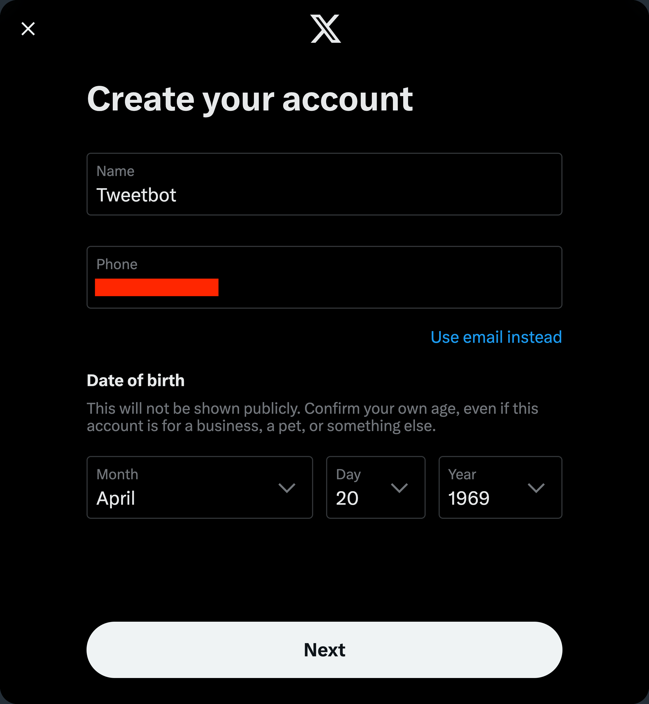
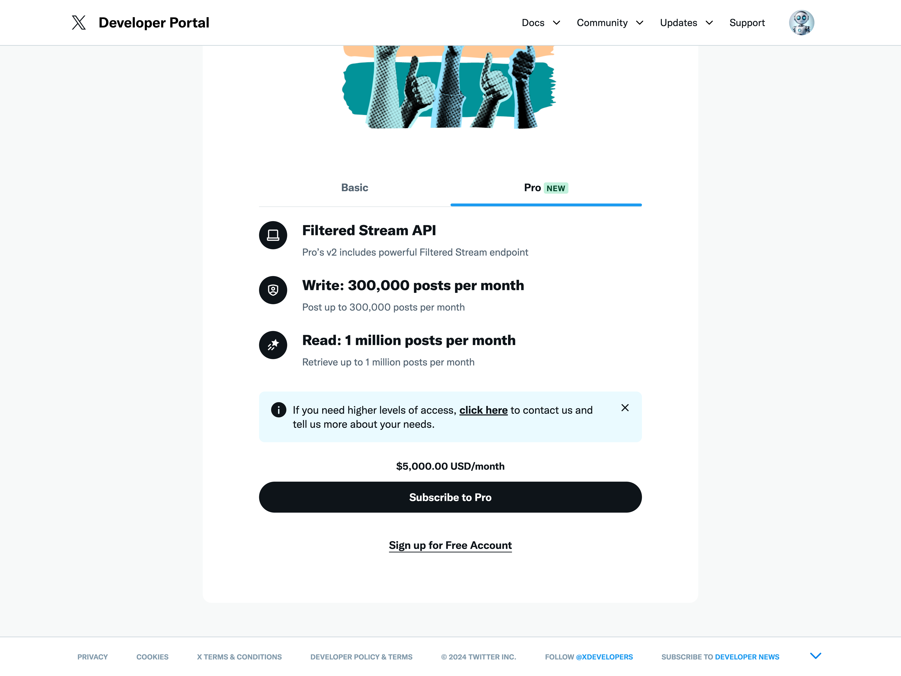
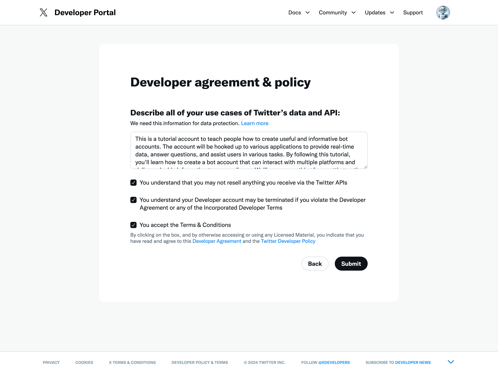
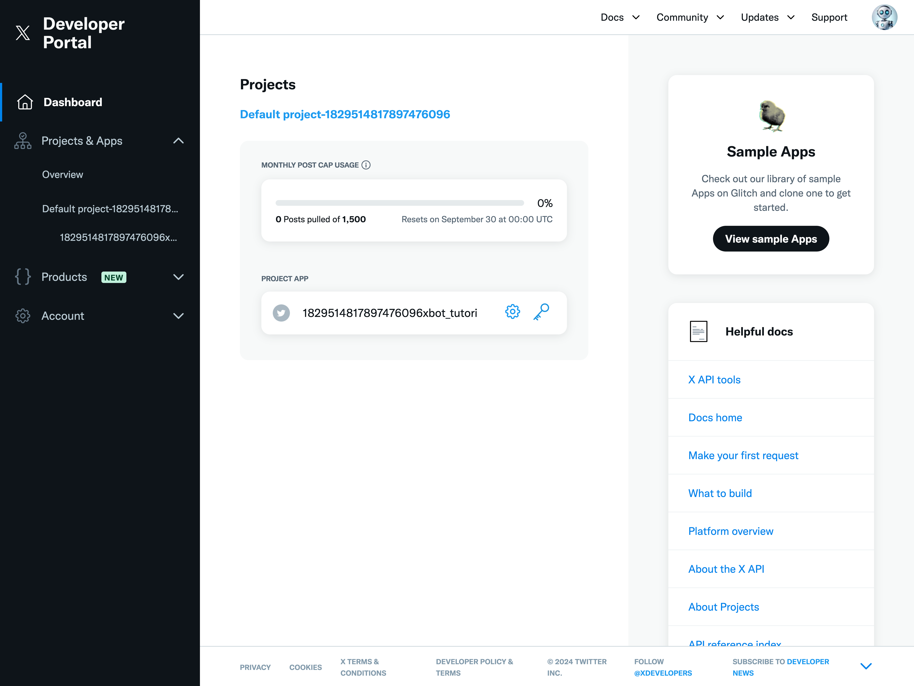
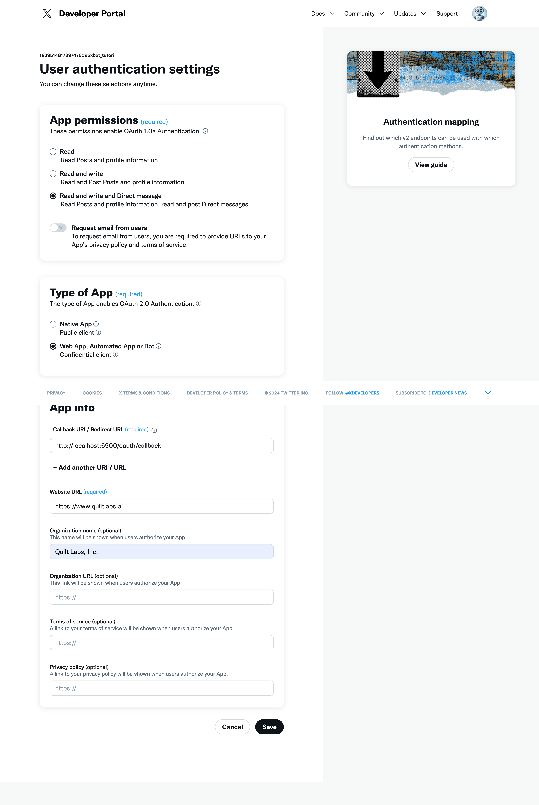
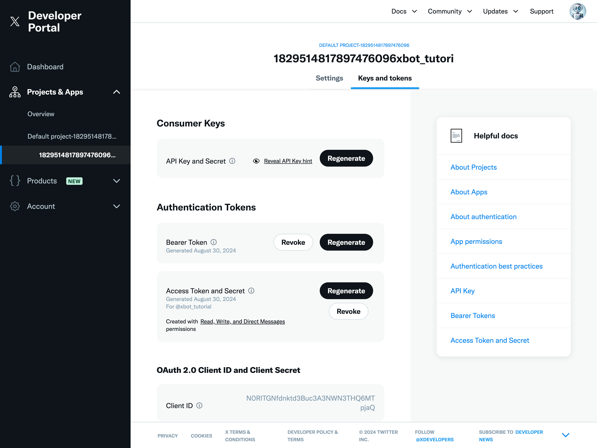

# API Setup Guide

This guide will walk you through the process of obtaining the necessary API access tokens for the tweet-server.

## Twitter API Setup

1. Sign up for a Twitter Developer account:

   a. Create a Twitter account if you don't already have one.
      
      

   b. Sign up for free API access at [Twitter Developer Portal](https://developer.twitter.com/en/portal/petition/essential/basic-info).
      
      

   c. Fill out the developer agreement and submit your application.
      
      

   Note: The Twitter Developer account application process may take some time for approval. Be prepared to wait for a response from Twitter before you can proceed with the next steps.

2. Once your developer account is approved, go to the Twitter Developer Portal (https://developer.twitter.com/en/portal/dashboard) and sign in with your Twitter account.

   

3. Create a new project and app in the developer portal if a default one doesn't exist. In most cases it will already exist.


4. Once your project is created, hit the gear icon to take you to the settings page.

    1. edit the User authentication settings

    2. Set app permission to read and write or read and write and direct message. This is important, your tweetbot will not work without this

    3. Set the type of app to be `Web App, Automated App or Bot`

    4. Set the callback URL to be `http://localhost:PORT/oauth/callback` where `PORT` is some local port. I used  `6900` for this project.

    5. Enter your website, and fill out any of the optional fields

    6. Hit save/enter

    7. You may get a popup asking you to save client ID and client secret. This is optional.

    


5. Now we will obtain the following keys:
   - API Key (Consumer Key)
   - API Key Secret (Consumer Secret)
   - Access Token
   - Access Token Secret

    1. Hit the `Keys and tokens` tab

    2. Generate your consumer key and the consumer key secret, write it down 

    3. Generate your access token and access token secret, write it down 


   


## Creating the Security Keys

1. In the root directory of the tweet-server project, create a folder named `security_keys`.

2. Inside the `security_keys` folder, create a file named `x.json` with the following content:

   ```json
   {
     "api_key": "your_twitter_api_key",
     "api_secret": "your_twitter_api_secret",
     "access_token": "your_twitter_access_token",
     "access_secret": "your_twitter_access_secret"
   }
   ```

   Replace the placeholder values with your actual Twitter API credentials.

3. In the same `security_keys` folder, create a file named `api_key.txt` containing a single line with your chosen API key for authenticating requests to the tweet-server. This can be any secure string you choose.

## Securing Your Credentials

Remember to keep your API credentials and keys secure:

- Never commit the `security_keys` folder to version control.
- Add `security_keys/` to your `.gitignore` file.
- Use environment variables or secure secret management systems in production environments.

With these steps completed, your tweet-server will be properly configured to use the Twitter API.
